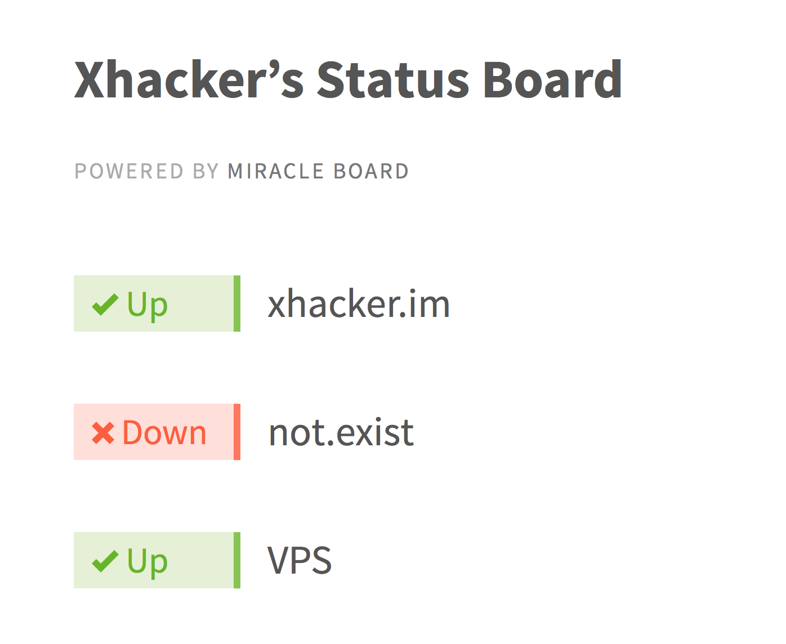

# Miracle Board

Just another damn simple status board, helps you to check if your websites are up.



## Configuration

Very simple.

```json
{
  "title": "Xhacker’s Status Board",
  "tasks": [
    {
      "type": "http",
      "id": "xhacker_im",
      "title": "xhacker.im",
      "address": "http://xhacker.im"
    },
    {
      "type": "shell",
      "id": "vps",
      "title": "VPS",
      "command": "ping -c 1 xhacker.im"
    }
  ]
}
```

By default, we expect ``http`` tasks to have status code ``200``, ``shell`` tasks to have return code ``0``. ``command`` field in ``shell`` tasks will be executed directly, please use with caution. ``id`` is for internal use, must be unique.

## Deployment

### Run locally

```bash
pip install -r requirements.txt
python hello.py
```

### Deploy

Please refer to Flask documentation: http://flask.pocoo.org/docs/0.10/deploying/

## License

MIT
